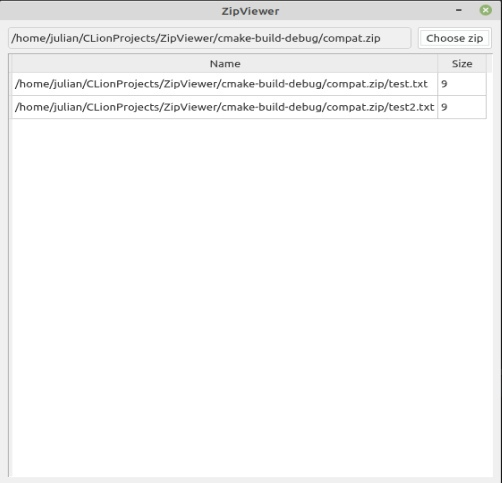

# ZipViewer
Simple ZipViewer

## Linking the library
First of all you should build library and install it

```cmake 
mkdir minizip-build 
mkdir minizip-install 
cmake -D CMAKE_INSTALL_PREFIX=minizip-install ... -S minizip-ng-master -B minizip-build 
cmake --build minizip-build 
cmake --install minizip-build find_package(minizip...PATHS ~your path~/minizip-install)
```

After this replace "include" and "lib" folders in a project.

## Building the project

Before the building you should install QT5 for properly working app.
After this run cmake in folder and run my application.

## The functionality 

As it's a simple viewer, so it can only view the content of zip archives.

Photo as an example:


